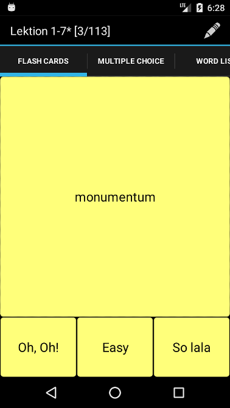

## Vocabs - vocabulary trainer

This App helps to learn the vocabulary of foreigner languages,
historical dates or any other information which can be presented in a
"Question-Answer" format.

The App interface provides three tabs:

FLASH CARDS - words are learned by the flashcard principle.

MULTIPLE CHOICE - words are learned by the multiple choice principle.

WORD LISTS - manage your list: download, edit, create new ones.

* Import lists created by other users on dict.cc
* Create new lists on your device
* Online translation while list creation
* Import/export lists
* Change settings

Settings:

"Invert language" - flip the Question-Answer pairs
Define a number of Rows and Columns
Change Tone settings (in case of correct/false answer)
Change Display settings like color, text size, etc.

Includes:

Latin-German basic vocabulary, ca. 800 words
English irregular verbs
German irregular verbs

### FLASH CARDS

### MULTIPLE CHOICE

### WORD LISTS

### Import from dict.cc

Following libraries are in use to implement certain functionality:

Library | Functionality
------------ | -------------
jsoup | [Java HTML Parser](https://jsoup.org/) - used for parsing html content when downloading lists from dict.cc
opencsv | [CSV java parser](http://opencsv.sourceforge.net/) - used to parse Coma Separated Values

Tips for setting up the project:

1. clone the project from git to location of your choice
2. on android studio wizard screen select "open existing project", don not "import project from..."
    since it wont't create local.properties file with sdk location
3. click on sync button in gradle window
4. it might work with "import..." too, but settings.gradle must be manually created I guess.
    settings.gradle contains the path to android sdk
